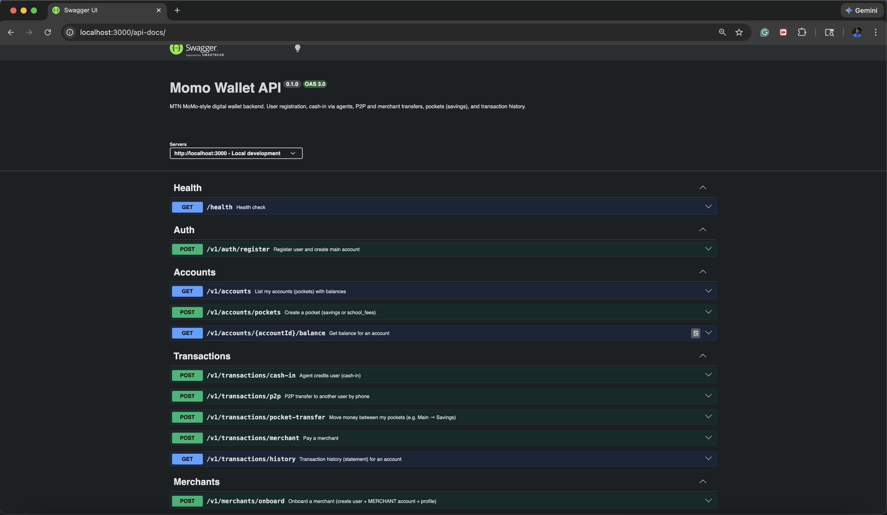

# Momo Wallet API

MTN MoMo–style digital wallet **backend only**: database, REST APIs, double-entry ledger. Built for one dev environment and local run.

## Swagger Docs:


## Tech stack

- **Runtime:** Node 18+
- **Language:** TypeScript
- **API:** Express
- **Database:** PostgreSQL
- **ORM:** Prisma (migrations, type-safe client, transactions)
- **Validation:** Zod

## Why PostgreSQL and double-entry?

- **ACID:** Money moves are wrapped in DB transactions; if the process or DB fails mid-transfer, the whole operation rolls back (no “deducted but not credited”).
- **Auditability:** We don’t just update a balance; every movement is a journal entry. Sum of entries per account = balance. Sum of entries per transaction = 0.
- **Scale:** Indexes on `phone_number`, `(account_id, created_at)`, and `external_ref` keep lookups and statement queries fast at high volume.

## Environments

- **Development** – Default. Uses `.env` or `.env.development` (optional override).
  - `cp .env.example .env` (or copy to `.env.development`).
  - Run with `npm run dev`; `NODE_ENV` defaults to `development` if unset.
- **Test** – Used by Jest. Uses `.env` then `.env.test` (later overrides).
  - `cp .env.test.example .env.test` and point `DATABASE_URL` to a test DB (e.g. `momo_wallet_test`).
  - Run tests with `npm test`; Jest sets `NODE_ENV=test` and config loads `.env.test`.
  - Use a separate test database so integration tests don’t affect dev data.

## Run locally

### 1. Prerequisites

- Node 18+
- Docker (for PostgreSQL) or a local PostgreSQL 14+

### 2. Clone and install

```bash
git clone <repo-url>
cd momo-challenge
npm install
```

### 3. Database

**Option A – Terraform (recommended: provisions dev + test DBs in one container)**

```bash
cd terraform
terraform init
terraform apply -auto-approve
cd ..
```

Then copy env files and run migrations (see below). Terraform creates both `momo_wallet` and `momo_wallet_test` via an init script.

**Option B – Docker Compose (dev DB only)**

```bash
docker compose up -d
```

Create the test DB manually if you run integration tests:  
`docker exec -it momo-postgres psql -U momo -d momo_wallet -c "CREATE DATABASE momo_wallet_test;"`

**Then (for either option):**

```bash
cp .env.example .env
cp .env.test.example .env.test
# Edit if needed (default: localhost:5432, momo/momo)
npm run db:generate
npm run db:push
npm run db:seed
```

### 4. Start the API

```bash
npm run dev
```

API base: `http://localhost:3000`.

- **API docs (Swagger UI):** `http://localhost:3000/api-docs`
- Health: `GET /health`
- Register: `POST /v1/auth/register`
- Accounts: `GET /v1/accounts` (requires `X-User-Id`)
- Cash-in: `POST /v1/transactions/cash-in`
- P2P: `POST /v1/transactions/p2p` (requires `X-User-Id`)
- Pocket transfer: `POST /v1/transactions/pocket-transfer` (requires `X-User-Id`)
- Merchant pay: `POST /v1/transactions/merchant` (requires `X-User-Id`)
- History: `GET /v1/transactions/history?accountId=...` (requires `X-User-Id`)
- Merchant onboarding: `POST /v1/merchants/onboard` (body: phoneNumber, businessName, categoryCode)

### Dev auth (no JWT yet)

For protected routes, send the **user UUID** in the header:

```bash
curl -H "X-User-Id: <user-id-from-register>" http://localhost:3000/v1/accounts
```

## API summary

| Method | Path                               | Description                                                              |
| ------ | ---------------------------------- | ------------------------------------------------------------------------ |
| POST   | `/v1/auth/register`                | Register user + create main account                                      |
| GET    | `/v1/accounts`                     | List my accounts (pockets) with balances                                 |
| POST   | `/v1/accounts/pockets`             | Create savings/school_fees pocket                                        |
| GET    | `/v1/accounts/:accountId/balance`  | Balance for one account                                                  |
| POST   | `/v1/transactions/cash-in`         | Agent credits user (body: agentCode, userPhoneNumber, amount)            |
| POST   | `/v1/transactions/p2p`             | Transfer to another user by phone (body: toPhoneNumber, amount)          |
| POST   | `/v1/transactions/pocket-transfer` | Move between my pockets (fromAccountId, toAccountId, amount)             |
| POST   | `/v1/transactions/merchant`        | Pay merchant (merchantAccountId, amount)                                 |
| GET    | `/v1/transactions/history`         | Statement (query: accountId, fromDate, toDate, type, limit, offset)      |
| POST   | `/v1/merchants/onboard`            | Create merchant (phoneNumber, businessName, categoryCode e.g. GROCERIES) |

Optional `idempotencyKey` (UUID) in request body for cash-in, p2p, pocket-transfer, and merchant pay to avoid double-processing.

## Database design (high level)

- **users** – phone_number (unique, indexed), full_name, gender, date_of_birth (for analytics).
- **accounts** – user_id, type (MAIN, SAVINGS, SCHOOL_FEES, MERCHANT), currency.
- **agents** – code, name, status (for cash-in).
- **merchant_categories** – code, name (e.g. GROCERIES, FUEL) for spending analytics.
- **merchant_profiles** – link account + category + business name.
- **transactions** – type, status, external_ref (idempotency), metadata (JSON).
- **journal_entries** – transaction_id, account_id, amount (credit/debit), currency. Double-entry: sum per transaction = 0.

Indexing: unique on `phone_number`; composite on `(account_id, created_at)` for history; index on `external_ref` for idempotency.

## Notifications

Currently a **mock**: logs to console. Replace `src/services/notification.ts` with real SMS/WhatsApp (e.g. Twilio) when needed.

## Testing

- **Jest + Supertest** for API tests. Tests live under `src/tests/`:
  - **`unit/`** – tests that don’t need a database (e.g. health check).
  - **`integration/`** – tests that hit the real API and DB (auth, accounts, transactions).
- Run all tests: `npm test` (coverage in `coverage/`).
- Run only unit tests: `npm run test:unit`.
- Run only integration tests: `npm run test:integration` (requires `DATABASE_URL`).
- Without a database, integration suites are skipped; only unit tests run.
- With `DATABASE_URL` set (e.g. in `.env.test` after `cp .env.test.example .env.test` and a test DB), full integration tests run: register, cash-in, P2P, pockets, history.

## API documentation (OpenAPI / Swagger)

- **Spec:** `docs/openapi.yaml` (OpenAPI 3.0).
- **Swagger UI:** when the API is running, open `http://localhost:3000/api-docs` to explore and try endpoints.



## Terraform

PostgreSQL for **dev + test** is defined under `terraform/` (Docker provider). One container exposes both databases (`momo_wallet`, `momo_wallet_test`).

- **Docker must be running** (e.g. start Docker Desktop) before `terraform apply`.
- From repo root: `cd terraform` then `terraform init` (once), then `terraform apply -auto-approve`.
- `terraform plan` / `terraform apply` – create/update container and volume
- `terraform destroy` – remove container and volume (data is lost)
- Optional: copy `terraform/terraform.tfvars.example` to `terraform/terraform.tfvars` to override port, image, or DB names.

## Scripts

- `npm run dev` – run API with ts-node-dev
- `npm run build` / `npm start` – production build and run
- `npm test` – run all tests with coverage
- `npm run test:unit` – run only unit tests
- `npm run test:integration` – run only integration tests (needs DB)
- `npm run test:watch` – run tests in watch mode
- `npm run db:push` – push schema (no migration files)
- `npm run db:migrate` – create and run migrations
- `npm run db:seed` – seed categories and sample agent
- `npm run db:studio` – open Prisma Studio
